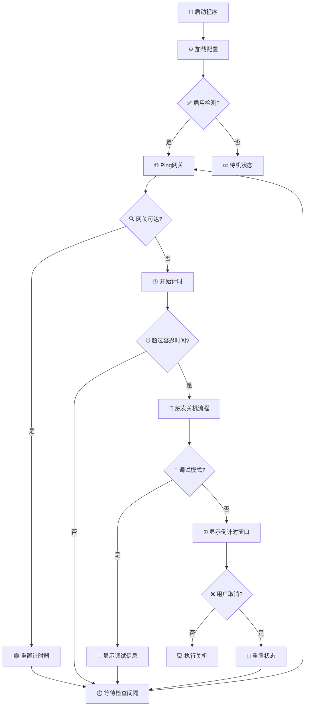

# 🛡️ PowerGuard

**🏠 给没有管理驱动的UPS设备实现断电自动关机功能**

[⭐ 给个Star支持一下](#-如果这个项目对您有帮助) | [🚀 快速开始](#-快速开始) | [📖 详细说明](#-使用说明) | [🐛 反馈问题](https://github.com/Tmcity/UtilityApp/issues)

---

## 🎯 项目简介

PowerGuard 是一个轻量级的断电监控工具，专为那些使用**丐版UPS**（没有管理软件/驱动）的用户设计。通过监控网络网关的可达性来判断是否断电，在检测到断电后自动触发安全关机流程，保护您的数据和硬件安全。

### 💡 为什么选择 PowerGuard？

- 🔌 **无需UPS驱动** - 适用于各种没有管理软件的UPS设备
- 🌐 **网络监控** - 通过监控路由器/网关来判断断电状态
- ⚡ **快速响应** - 实时检测，断电后迅速启动关机流程
- 🎨 **现代界面** - 精美的深色主题UI，支持系统托盘
- 🛠️ **高度可定制** - 可调节的检测间隔、容忍时间、倒计时时长
- 🚀 **开机自启** - 设置一次，永久守护

---

## ✨ 功能特性

### 🔍 核心功能
| 功能 | 描述 | 状态 |
|------|------|------|
| 🌐 **网关监控** | 定期Ping指定网关，监控网络连通性 | ✅ |
| ⏰ **智能判断** | 可自定义停电容忍时间，避免误触发 | ✅ |
| 🔔 **关机倒计时** | 优雅的倒计时窗口，支持取消操作 | ✅ |
| 🧪 **调试模式** | 测试模式，不会真正关机 | ✅ |
| 📊 **实时日志** | 详细的运行日志，便于故障排查 | ✅ |
| 🎯 **系统托盘** | 最小化到托盘，不占用任务栏空间 | ✅ |
| 🚀 **开机自启** | 开机时自动启动程序，持续守护 | ✅ |
| 📡 **信息推送** | 支持通过Webhook等发送状态通知 | ⏳ |

### ⚙️ 高级特性
- **🔧 自动保存设置** - 修改即保存，无需手动操作
- **🎛️ 灵活配置** - 检查间隔(1-3600秒)、停电容忍时间(5-7200秒)、关机倒计时(10-600秒)
- **🛡️ 输入验证** - 智能的参数验证，防止无效配置
- **🔄 延迟验证** - 友好的输入体验，不会在输入过程中打断用户

---

## 🚀 快速开始

### 📋 系统要求
- 🖥️ Windows 10/11 (x64)
- 🔧 .NET 8.0 Runtime
- 🌐 能够访问网关/路由器的网络环境

### 📦 安装步骤

1. **下载最新版本**

   从 Releases 页面下载最新版本

2. **运行程序**
   - 📁 解压到任意目录
   - 🚀 双击 `PowerGuard.exe` 启动
   - 🎯 首次运行会显示主界面进行配置

3. **基础配置**
   - 🌐 **网关地址**: 输入您的路由器IP (通常是 `192.168.x.x`)
   - ⏱️ **检查间隔**: 建议设置为 `10` 秒
   - 🕐 **停电容忍时间**: 建议设置为 `60` 秒
   - ⏰ **关机倒计时**: 建议设置为 `120` 秒

---

## 📖 使用说明

### 🎛️ 主界面说明

| 设置项 | 说明 | 推荐值 | 范围 |
|--------|------|--------|------|
| 🌐 **网关地址** | 要监控的路由器/网关IP地址 | `192.168.1.1` | 有效IP地址 |
| ⏱️ **检查间隔** | 多久检查一次网关连通性 | `10秒` | 1-3600秒 |
| 🕐 **停电容忍时间** | 网关不可达多久后触发关机 | `60秒` | 5-7200秒 |
| ⏰ **关机倒计时** | 关机前的倒计时时长 | `120秒` | 10-600秒 |

### 🔘 功能开关

- ✅ **启用检测** - 开启/关闭断电监控功能
- 🚀 **开机自启** - 开机时自动启动PowerGuard
- 🧪 **调试模式** - 测试模式，不会真正执行关机

### 📊 监控状态

程序会实时显示当前状态：
- 🟢 **网关可达** - 网络正常，一切安好
- 🟡 **网关不可达 (剩余 X 秒)** - 检测到网络中断，倒计时中
- 🔴 **关机中...** - 触发关机流程

---

## 🛠️ 工作原理

### 📡 监控流程

### 🧠 核心逻辑

1. **🔍 智能检测** - 通过ICMP Ping检测网关连通性
2. **⏱️ 容错机制** - 支持短暂网络波动，避免误触发
3. **🚨 安全关机** - 多重确认，确保数据安全
4. **👤 用户友好** - 倒计时窗口支持取消操作

---

## ⚙️ 高级配置

### 🎯 推荐配置场景

| 使用场景 | 检查间隔 | 停电容忍时间 | 关机倒计时 | 说明 |
|----------|----------|--------------|------------|------|
| 🏠 **家庭用户** | 10秒 | 60秒 | 120秒 | 平衡的默认配置 |
| 🏢 **办公环境** | 5秒 | 30秒 | 180秒 | 快速响应，充足操作时间 |
| 🎮 **游戏玩家** | 15秒 | 90秒 | 300秒 | 避免游戏中误触发 |
| 🖥️ **服务器** | 5秒 | 20秒 | 60秒 | 快速关机，保护硬件 |

### 📝 配置文件位置
- 📂 配置文件: `user.config` (`%APPDATA%\PowerGuard\`下)
- 📋 日志文件: `PowerGuard.log` (程序目录)

---

## 🎨 界面预览

### 🌙 现代深色主题
- **精美界面** - 现代化的深色主题设计
- **直观布局** - 合理的信息层次结构
- **实时反馈** - 状态信息一目了然
- **响应式设计** - 支持窗口缩放

### 🎯 系统托盘集成
- **最小化到托盘** - 不占用任务栏空间
- **右键菜单** - 彻底退出程序或打开主界面
- **状态指示** - 托盘图标显示运行状态（待实现）

---

### 🐛 报告问题
遇到问题？请通过 [Issues](https://github.com/Tmcity/UtilityApp/issues) 告诉我：
- 🖥️ 操作系统版本
- 🔧 .NET 版本
- 📝 详细的错误描述
- 🔄 重现步骤

---

## ❓ 常见问题

🤔 为什么选择监控网关而不是其他方式？

路由器通常是家庭/办公网络的核心设备，断电时最先失去连接。监控网关是判断断电最可靠的方法之一，而且不需要额外的硬件支持。

🛡️ 程序是否需要管理员权限？

正常使用不需要管理员权限。只有在设置开机自启时可能需要写入注册表权限，但程序会自动处理这些权限请求。

🔌 我的UPS只能支撑几分钟，如何配置？

建议将"停电容忍时间"设置为较短的值（如30秒），"关机倒计时"也设置短一些（如60秒），确保在UPS电量耗尽前完成关机。

🌐 网络偶尔会断开，如何避免误触发？

适当调整"停电容忍时间"，比如设置为60-120秒。这样可以容忍短暂的网络波动，只有在持续断网时才会触发关机。

---

## 📄 许可证

本项目基于 MIT 许可证开源 - 查看 [LICENSE](LICENSE) 文件了解详情。

---

## ⭐ 如果这个项目对您有帮助

如果 PowerGuard 帮助您解决了UPS断电关机的问题，请考虑：

### 🌟 给个 Star 支持一下！🌟

